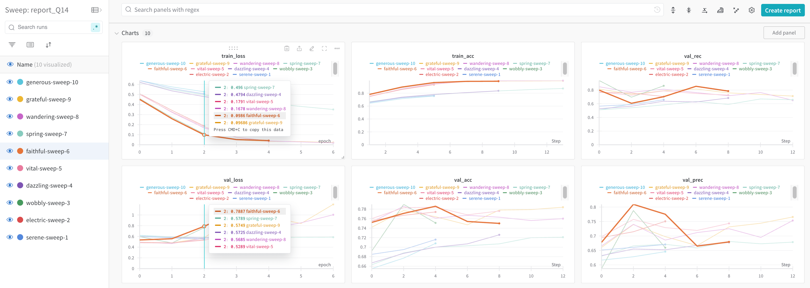
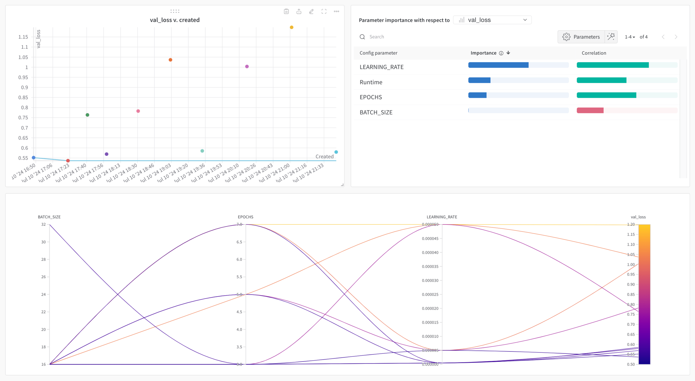
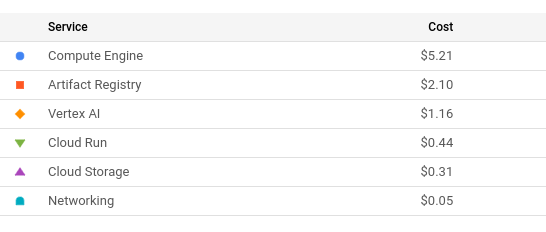
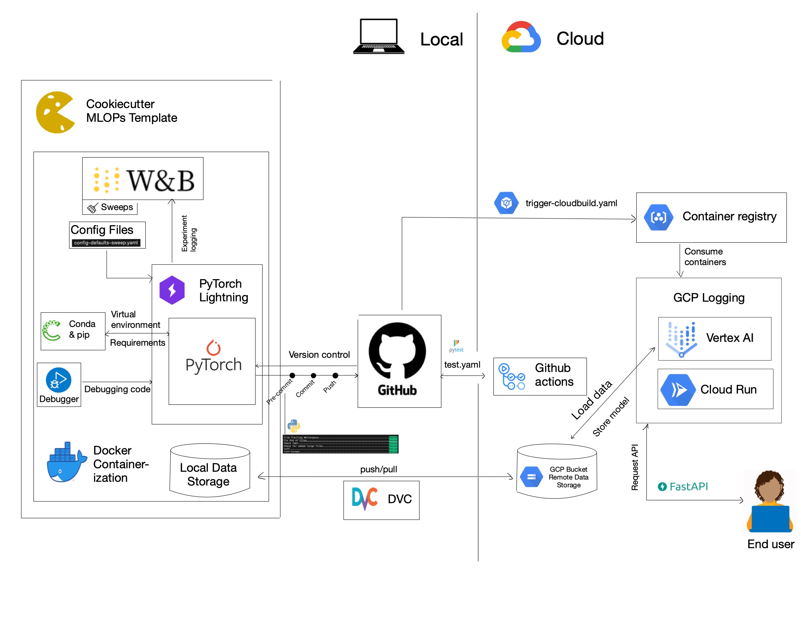

# Exam template for Machine Learning Operations

This is the report template for the exam. Please only remove the text formatted as with three dashes in front and behind
like:

```--- question 1 fill here ---```

where you instead should add your answers. Any other changes may have unwanted consequences when your report is
auto-generated at the end of the course. For questions where you are asked to include images, start by adding the image
to the `figures` subfolder (please only use `.png`, `.jpg` or `.jpeg`) and then add the following code in your answer:

```markdown

```

In addition to this markdown file, we also provide the `report.py` script that provides two utility functions:

Running:

```bash
python report.py html
```

will generate a `.html` page of your report. After the deadline for answering this template, we will auto-scrape
everything in this `reports` folder and then use this utility to generate an `.html` page that will be your serve
as your final hand-in.

Running

```bash
python report.py check
```

will check your answers in this template against the constraints listed for each question e.g. is your answer too
short, too long, or have you included an image when asked to.

For both functions to work you mustn't rename anything. The script has two dependencies that can be installed with

```bash
pip install click markdown
```

## Overall project checklist

The checklist is *exhaustive* which means that it includes everything that you could do on the project included in the
curriculum in this course. Therefore, we do not expect at all that you have checked all boxes at the end of the project. (ENES)

### Week 1

* [✔] Create a git repository
* [✔] Make sure that all team members have write access to the GitHub repository
* [✔] Create a dedicated environment for you project to keep track of your packages
* [✔] Create the initial file structure using cookiecutter
* [✔] Fill out the `make_dataset.py` file such that it downloads whatever data you need and
* [✔] Add a model file and a training script and get that running
* [✔] Remember to fill out the `requirements.txt` file with whatever dependencies that you are using
* [✔] Remember to comply with good coding practices (`pep8`) while doing the project
* [✔] Do a bit of code typing and remember to document essential parts of your code
* [✔] Setup version control for your data or part of your data
* [✔] Construct one or multiple docker files for your code
* [✔] Build the docker files locally and make sure they work as intended
* [✔] Write one or multiple configurations files for your experiments
* [✔] Used Hydra to load the configurations and manage your hyperparameters -> Comment: We used Weights and Biases
* [ ] When you have something that works somewhat, remember at some point to to some profiling and see if
      you can optimize your code
* [✔] Use Weights & Biases to log training progress and other important metrics/artifacts in your code. Additionally,
      consider running a hyperparameter optimization sweep.
* [✔] Use Pytorch-lightning (if applicable) to reduce the amount of boilerplate in your code

### Week 2

* [✔] Write unit tests related to the data part of your code
* [✔] Write unit tests related to model construction and or model training
* [✔] Calculate the coverage.
* [✔] Get some continuous integration running on the GitHub repository
* [✔] Create a data storage in GCP Bucket for you data and preferable link this with your data version control setup
* [✔] Create a trigger workflow for automatically building your docker images
* [✔] Get your model training in GCP using either the Engine or Vertex AI
* [✔] Create a FastAPI application that can do inference using your model
* [ ] If applicable, consider deploying the model locally using torchserve
* [✔] Deploy your model in GCP using either Functions or Run as the backend

### Week 3

* [ ] Check how robust your model is towards data drifting
* [ ] Setup monitoring for the system telemetry of your deployed model
* [ ] Setup monitoring for the performance of your deployed model
* [ ] If applicable, play around with distributed data loading
* [ ] If applicable, play around with distributed model training
* [ ] Play around with quantization, compilation and pruning for you trained models to increase inference speed

### Additional

* [✔] Revisit your initial project description. Did the project turn out as you wanted?
* [✔] Make sure all group members have a understanding about all parts of the project
* [✔] Uploaded all your code to github

## Group information

### Question 1
> **Enter the group number you signed up on <learn.inside.dtu.dk>**
>
> Answer:

NaN

### Question 2
> **Enter the study number for each member in the group**
>
> Answer:

Enes Özeren (12788990)

Julia Broden (12502042)

Daniel Gloukhman (12864164)

### Question 3
> **What framework did you choose to work with and did it help you complete the project?**
>
> Recommended answer length: 100-200 words.
>
> Example:
> *We used the third-party framework ... in our project. We used functionality ... and functionality ... from the*
> *package to do ... and ... in our project*.
>
> Answer:


We used the third-party framework `Transformers` from Hugging Face in our project. It provides the `BertForSequenceClassification` model, which is a natural language processing (NLP) model where we only need to fine-tune the classification layer for our purpose of hate speech detection. Furthermore, it provides the `BertTokenizer` with which we can tokenize the tweets. We worked with the `PyTorch Lightning` framework to train and validate our model, using the `Trainer` class. To track our model performance, we used `torchmetrics`. Weights and Biases was used both to handle the configuration file with the hyperparameters and to do hyperparameter sweeps, as well as for logging the training and validation loss and metrics.


## Coding environment

> In the following section we are interested in learning more about you local development environment.

### Question 4

> **Explain how you managed dependencies in your project? Explain the process a new team member would have to go**
> **through to get an exact copy of your environment.**
>
> Recommended answer length: 100-200 words
>
> Example:
> *We used ... for managing our dependencies. The list of dependencies was auto-generated using ... . To get a*
> *complete copy of our development environment, one would have to run the following commands*
>
> Answer:


We used `conda` for creating virtual environments and `pip` for managing dependencies. We manually crafted a `requirements.txt` file with all our dependencies. To have a smaller container size, we additionally outsourced  our developement dependencies to a separate file. To recreate our environment, run the following code in the root directory of this repository:

```bash
conda env create --file environment.yaml
conda activate mlops_base
pip install -r requirements.txt
pip install -r requirements_dev.txt
```

### Question 5

> **We expect that you initialized your project using the cookiecutter template. Explain the overall structure of your**
> **code. Did you fill out every folder or only a subset?**
>
> Recommended answer length: 100-200 words
>
> Example:
> *From the cookiecutter template we have filled out the ... , ... and ... folder. We have removed the ... folder*
> *because we did not use any ... in our project. We have added an ... folder that contains ... for running our*
> *experiments.*
> Answer:

We have used cookiecutter with MLOPs Template. We removed some folders that were not needed for our project. We explain all the folders in our project [README.md](/README.md). We added the `cloudbuild`, `dockerfiles`, `utils`, `api` directories and couple of custom scripts.

### Question 6

> **Did you implement any rules for code quality and format? Additionally, explain with your own words why these**
> **concepts matters in larger projects.**
>
> Recommended answer length: 50-100 words.
>
> Answer:

We implemented a pre-commit pipeline to enforce code linting and formatting with `ruff`. Additionally everyone used the `isort` extension in their local vscode instance. We also followed the pep8 style guide for python-code. When working in a team it is important to enforce those rules to have a uniform codebase. And thus make it easier for other team-members to onboard and work with the code.


## Version control

> In the following section we are interested in how version control was used in your project during development to
> corporate and increase the quality of your code.

### Question 7

> **How many tests did you implement and what are they testing in your code?**
>
> Answer:

We have implemented 17 tests. Our focus was testing dataset, training, prediction, api and util functions which
are the core scripts for our repo.

### Question 8

> **What is the total code coverage (in percentage) of your code? If you code had an code coverage of 100% (or close**
> **to), would you still trust it to be error free? Explain you reasoning.**
>
> Answer:

Total coverage of code is 85%. We are not too close to 100% becuase of the challenges of testing
the training and prediction scripts. Even we covered 100%, we still can not be sure all the code is error free becuase
the coverage only measures if everyline is tested, but there can be other edge scenarios or some logic errors.

### Question 9

> **Did you workflow include using branches and pull requests? If yes, explain how. If not, explain how branches and**
> **pull request can help improve version control.**
>
> Recommended answer length: 100-200 words.
>
> Example:
> *We made use of both branches and PRs in our project. In our group, each member had an branch that they worked on in*
> *addition to the main branch. To merge code we ...*
>
> Answer:

We made use of both branches and PRs in our project. Each member of our group had a personal branch where they worked on their features or bug fixes independently of the main branch. This setup allowed us to develop and test our changes without affecting the main codebase. To merge code, a member would create a PR once their feature was complete and tested. Other team members would then review the PR, providing feedback or requesting modifications if necessary. A reviewer would then approve the PR and merge it into the main branch. If merge conflicts arose, they would be resolved collaboratively to make sure that all changes were correctly integrated and nothing was lost. In addition, tests are performed before merging a branch into the main branch to verify that the code remains functional after the merge.


### Question 10

> **Did you use DVC for managing data in your project? If yes, then how did it improve your project to have version**
> **control of your data. If no, explain a case where it would be beneficial to have version control of your data.**
>
> Answer:

We have used DVC for data version & data storing & trained model weights storing. This approach helped us with
storing big files. Especially our model weight files are much bigger than we can store in github so using DVC with GCP
was a great solution as well. Also DVC is great for versioning the dataset used for training but throughout our project
we have only used 1 version of the dataset.

### Question 11

> **Discuss you continuous integration setup. What kind of continuous integration are you running (unittesting,**
> **linting, etc.)? Do you test multiple operating systems, Python  version etc. Do you make use of caching? Feel free**
> **to insert a link to one of your GitHub actions workflow.**
>
> Recommended answer length: 200-300 words.
>
> Example:
> *We have organized our continuous integration into 3 separate files: one for doing ..., one for running ... testing*
> *and one for running ... . In particular for our ..., we used ... .An example of a triggered workflow can be seen*
> *here: <weblink>*
>
> Answer:

We use `Github Actions` in combination with `Google Cloudbuild` for continious integration and deployment. In order to ensure that a new feature doesn't introduce any bugs with the codebase we run all [unittests](https://github.com/enesozeren/lmu-mlops-project/actions/runs/9879223038/job/27284970551) when a pull request is created via a github action workflow. After a pullrequest is merged another [action](https://github.com/enesozeren/lmu-mlops-project/blob/main/.github/workflows/trigger-cloudbuild.yaml) is triggering the building of all docker containers, the training of the model with `Vertex AI` and deployment of the resulting model.

## Running code and tracking experiments

> In the following section we are interested in learning more about the experimental setup for running your code and
> especially the reproducibility of your experiments.

### Question 12

> **How did you configure experiments? Did you make use of config files? Explain with coding examples of how you would**
> **run a experiment.**
>
> Recommended answer length: 50-100 words.
>
> Example:
> *We used a simple argparser, that worked in the following way: Python  my_script.py --lr 1e-3 --batch_size 25*
>
> Answer:

When training the model the hyperparameters are passed using `argparser`, i.e.

```bash
python mlops_project/train_model.py --config=mlops_project/config/config-defaults-sweep.yaml
```

We implemented hyperparameter tuning using W&B sweeps. A sweep is bassed to the `wandb.agent`. The search method such as grid search or random serach can be chosen. The configuration file contains the batch size, number of epochs, and the learning rate. The experiments were logged through `WandbLogger`.


### Question 13

> **Reproducibility of experiments are important. Related to the last question, how did you secure that no information**
> **is lost when running experiments and that your experiments are reproducible?**
>
> Recommended answer length: 100-200 words.
>
> Example:
> *We made use of config files. Whenever an experiment is run the following happens: ... . To reproduce an experiment*
> *one would have to do ...*
>
> Answer:


To guarantee the reproducibility of our experiments and prevent information loss, we implemented several key aspects:

#### Controlling Randomness
We established fixed seed values for potential sources of randomness, in particular for PyTorch torch.manual_seed(<seed>), Python's random module random.seed(<seed>) NumPy np.random.seed(<seed>) and PyTorch Lightning seed_everything(). Additionally, we developed a custom seed_worker function to manage seeds for parallel workers, ensuring consistency across multi-threaded operations.

#### Hyperparameter Management
We utilized config files to maintain fixed hyperparameter values throughout our experiments. This approach was also used in the hyperparameter tuning process, where we employed an exhaustive grid search method rather than random sampling, further enhancing reproducibility.

#### Environment Consistency
By using Docker containers, we ensured that all models were executed within identical environments, eliminating variations due to system-specific differences.

#### Comprehensive Logging
To save all relevant information during experiments, we integrated Weights & Biases as our logging tool. This allowed us to capture and store detailed metrics, model parameters, and experimental conditions.

All in all, reproducible models helped us in the debugging process and with model comparability.


### Question 14

> **Upload 1 to 3 screenshots that show the experiments that you have done in W&B (or another experiment tracking**
> **service of your choice). This may include loss graphs, logged images, hyperparameter sweeps etc. You can take**
> **inspiration from [this figure](figures/wandb.png). Explain what metrics you are tracking and why they are**
> **important.**
>
> Recommended answer length: 200-300 words + 1 to 3 screenshots.
>
> Example:
> *As seen in the first image when have tracked ... and ... which both inform us about ... in our experiments.*
> *As seen in the second image we are also tracking ... and ...*
>
> Answer:

In our experiments tracked on W&B, we focus on monitoring essential metrics to assess model performance and optimize hyperparameters effectively. As seen in the first image we have tracked training loss, training accuracy, validation loss, validation accuracy, validation recall, and validation precision.

We track training loss and training accuracy to measure how well the model fits the training data. These metrics help us understand the model's learning process and its ability to correctly classify training examples. Validation loss and validation accuracy are crucial indicators of how well the model generalizes to unseen data. They provide insights into whether the model is overfitting or underfitting. Additionally, validation recall and validation precision are tracked to evaluate the model's ability to correctly identify positive instances and the precision of these predictions. These metrics are essential for diagnosing model performance issues and ensuring that the model meets the desired standards of accuracy and reliability. They help us make informed decisions about model improvements and hyperparameter tuning, ensuring our models are robust and accurate.


The second image shows the monitoring of a hyperparameter sweep, tuning the batch size, number of epochs and learning rate. By systematically varying these parameters and observing their impact on model performance, we aim to find the optimal configuration that minimizes the validation loss.



### Question 15

> **Docker is an important tool for creating containerized applications. Explain how you used docker in your**
> **experiments? Include how you would run your docker images and include a link to one of your docker files.**
>
> Recommended answer length: 100-200 words.
>
> Example:
> *For our project we developed several images: one for training, inference and deployment. For example to run the*
> *training docker image: `docker run trainer:latest lr=1e-3 batch_size=64`. Link to docker file: <weblink>*
>
> Answer:

For our project we developed several images: one base image for all other images, one for training, one for local prediction and one for serving an api. Using a base image allowed us to reduce the buildtime considerably, as all images have the same dependcies. All dockerfiles are stored in the dedicated `/dockerfiles` directory. Running an experiment with different hyperparametes can simply be done by creating another config file. For example to run the [training container](https://github.com/enesozeren/lmu-mlops-project/blob/main/dockerfiles/train_model.dockerfile) run the following command in the terminal:

```docker
docker run -e WANDB_API_KEY=XXXXX -it -v $(pwd)/data:/mlops_project/data europe-west3-docker.pkg.dev/lmumlops/hatespeech-detection-docker-repo/train-model --config config/config-defaults-sweep.yaml
```

### Question 16

> **When running into bugs while trying to run your experiments, how did you perform debugging? Additionally, did you**
> **try to profile your code or do you think it is already perfect?**
>
> Answer:

We have all used VS code for debugging. We did not profile our code because most algorithms we have used were
from ready to use packages like pytorch-lightning.

## Working in the cloud

> In the following section we would like to know more about your experience when developing in the cloud.

### Question 17

> **List all the GCP services that you made use of in your project and shortly explain what each service does?**
>
> Answer:

We have used the following GCP services: Bucket, Artifact Storage, Build, Run, Compute Engine, Vertex AI.
- GCP Bucket: for storing data and model weights (with DVC)
- GCP Artifact Store: for storing our docker images, updating them in continuous integration and using them for Cloud Run APIs
- GCP Build: for continuous integration (everytime a PR is merged, docker images are build again and stored in Artifact Store)
- GCP Run: for serving our inference api and updating the docker image behind our API with our continuous integration set up.
- GCP Compute Engine: Used for training our model with GPUs.
- GCP Vertex AI: Used for automatically training our model everytime a PR is merged with our continuous integration.
- GCP Secret Manager for passing api keys to the docker images

### Question 18

> **The backbone of GCP is the Compute engine. Explained how you made use of this service and what type of VMs**
> **you used?**
>
> Recommended answer length: 100-200 words.
>
> Example:
> *We used the compute engine to run our ... . We used instances with the following hardware: ... and we started the*
> *using a custom container: ...*
>
> Answer:

Since training on CPU takes a long time we have used a `n1-standard-8` machine with a `NVIDIA_TESLA_T4` GPU as an accelerator. We used the virtual machine mainly for testing and devloping our training script. After the developement we packed the script into a docker container and run the training in `Vertex Ai` with workers having the same specification. Also another advantage of the VMs was the faster link to our container registry.

### Question 19

> **Insert 1-2 images of your GCP bucket, such that we can see what data you have stored in it.**
>
> Answer:

See the image for our GCP Bucket ([GCP Bucket](figures/gcp_bucket.png)).
We store our data and model weights in it ([Inside GCP Bucket](figures/inside_gcp_gucket.png)).

### Question 20

> **Upload one image of your GCP artifact registry, such that we can see the different images that you have stored.**
>
> Answer:

See the image for our GCP Artifact Registry ([GCP Artifact Registry](figures/gcp_artifact_registry.png)).
We store and continuously build our docker images in it ([Inside GCP Artifact Registry](figures/inside_gcp_artifact_registry.png)).

### Question 21

> **Upload one image of your GCP cloud build history, so we can see the history of the images that have been build in**
>
> Answer:

See the image for our GCP Cloud Build history ([GCP Cloud Build History](figures/gcp_build.png)).

### Question 22

> **Did you manage to deploy your model, either in locally or cloud? If not, describe why. If yes, describe how and**
> **preferably how you invoke your deployed service?**
>
> Answer:

To deploy our inference api we have used FastAPI. We first run the API locally to test and after successful tests,
we have created a docker file for our fastapi app (also tested this locally). Then we have deployed our model with Cloud Run
with the docker container. And this container behind our Cloud Run API is also automatically build and updated with our
continuous cloud integration. To invoke our API with a single sample one can use:
*`curl -X POST https://hate-speech-detection-cloudrun-api-sjx4y77sda-ey.a.run.app/predict_labels_one_tweet -F "tweet=this is my twwetttt"`*
You can also see the load tests with locust package in this figure: [API Load Test](figures/api_load_test.png)

### Question 23

> **Did you manage to implement monitoring of your deployed model? If yes, explain how it works. If not, explain how**
> **monitoring would help the longevity of your application.**
>
> Answer:

We did not manage to implement monitoring. But after starting to have some user requests over time, monitoring
the input data & feature shift and the performance of our api would be very crucial for our application. By monitoring
those, we can make sure that our model is still suitable for the usage after time, and also user's experience is as expected.

### Question 24

> **How many credits did you end up using during the project and what service was most expensive?**
>
> Recommended answer length: 25-100 words.
>
> Example:
> *Group member 1 used ..., Group member 2 used ..., in total ... credits was spend during development. The service*
> *costing the most was ... due to ...*
>
> Answer:

We spent around US$9.26 dollar. The service costing the most was the Compute Engine  (with GPU).


## Overall discussion of project

> In the following section we would like you to think about the general structure of your project.

### Question 25

> **Include a figure that describes the overall architecture of your system and what services that you make use of.**
> **You can take inspiration from [this figure](figures/overview.png). Additionally in your own words, explain the**
> **overall steps in figure.**
>
> Recommended answer length: 200-400 words
>
> Example:
>
> *The starting point of the diagram is our local setup, where we integrated ... and ... and ... into our code.*
> *Whenever we commit code and push to github, it auto triggers ... and ... . From there the diagram shows ...*
>
> Answer:



### Question 26

> **Discuss the overall struggles of the project. Where did you spend most time and what did you do to overcome these**
> **challenges?**
>
> Recommended answer length: 200-400 words.
>
> Example:
> *The biggest challenges in the project was using ... tool to do ... . The reason for this was ...*
>
> Answer:

- Enes Comments: We had some struggles with the continuous integration with cloud. Sometimes erros about GCP permission
were complicated to solve but we have come up with solutions by checking the documentation & some forums.

- Daniel Comments: Since we have a lot of dependendcies wie large libraries our docker images became large in size. On the one hand this means building takes a long time but also dowloading and pushing the images from/to the registry takes a long time. We mitigated this issue a bit by using cloudbuild and pulling the images to the compute engine VMs that have a fast internet connection. This lead to a long bugfix cycle. Another issue was dealing with the IAM system of GCP that isn't always streight forward.

### Question 27

> **State the individual contributions of each team member. This is required information from DTU, because we need to**
> **make sure all members contributed actively to the project**
>
> Recommended answer length: 50-200 words.
>
> Example:
> *Student sXXXXXX was in charge of developing of setting up the initial cookie cutter project and developing of the*
> *docker containers for training our applications.*
> *Student sXXXXXX was in charge of training our models in the cloud and deploying them afterwards.*
> *All members contributed to code by...*
>
> Answer:

- Enes' Responsibilities:
- - Writing scripts to crawl the dataset from a github repo. Storing the data with DVC. Also writing the unit tests for dataset.
- - Developing prediction script and the docker file for that. Also writing unit tests for prediction script
- - Development of some utility functions and unit tests for them.
- - Creating a Fastapi, creating dockerfile for it, deploying the api with Cloud Run and Functions. Writing
unit tests and load test scripts for the api. Also developed the continuous integration for Cloud Run.
- - Setting up the Github Actions for unit tests & credentials & rules of the repository (review requirements etc.).
- Julia's Responsibilities:
- - TBD
- Daniel's Responsibilities: TBD
- - Building a precommit pipeline for mantaining uniform formatting
- - migrating dvc repository to google cloud bucket
- - working with GCP
- - optimizing docker files and building them in the cloud
- - building a continious integration and deployment pipeline with github actions and google cloudbuild
- - running training in the cloud
